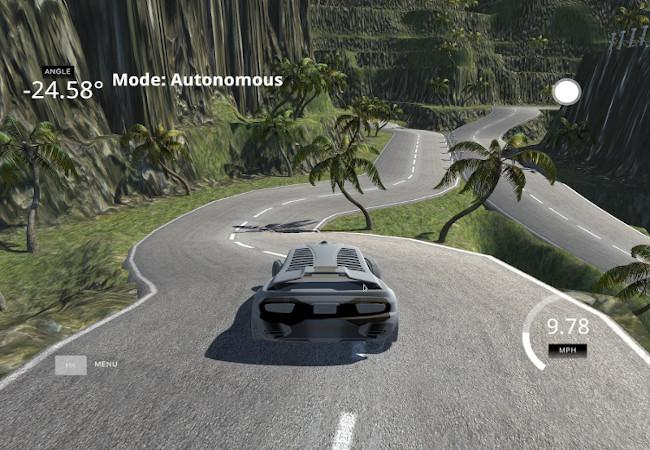
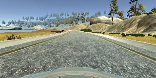
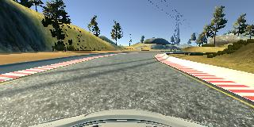
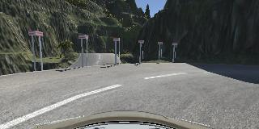
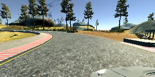
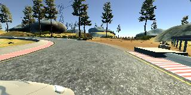

# **Behavioral Cloning Project**

[](http://www.udacity.com/drive)

The goals / steps of this project are the following:
* Use [the simulator](https://github.com/udacity/self-driving-car-sim) to collect data of good driving behavior
* Build a convolution neural network in Keras that predicts steering angles from images
* Train and validate the model with a training and validation set
* Test that the model successfully drives around track one without leaving the road
* Summarize the results with a written report



## Rubric Points

### Here I will consider the [rubric points](https://review.udacity.com/#!/rubrics/432/view) individually and describe how I addressed each point in my implementation.  

---

### Files Submitted & Code Quality

#### 1. Submission includes all required files and can be used to run the simulator in autonomous mode

My project includes the following files:
* [model.py](./model.py) containing the script to create and train the model
* [drive.py](./drive.py) for driving the car autonomously
* [model.h5](./model.h5) containing a trained convolution neural network
* [videos/track1.mp4](./videos/track1.mp4) showing the model driving on the first track
* [videos/track2.mp4](./videos/track2.mp4) showing the model driving on the second track
* [README.md](./README.md) summarizing the results

#### 2. Submission includes functional code

Using the Udacity provided simulator and my drive.py file, the car can be driven autonomously around the track by executing

```sh
python drive.py model.h5
```

#### 3. Submission code is usable and readable

The model.py file contains the code for training and saving the convolution neural network. The file shows the pipeline I used for training and validating the model, and it contains comments to explain how the code works.

### Model Architecture and Training Strategy

#### 1. An appropriate model architecture

I used the convolutional architecture from NVIDIA's [End to End Learning for Self-Driving Cars](https://arxiv.org/pdf/1604.07316.pdf) paper as the basis for my model, which includes 3 convolutional layers with 5x5 filter sizes and 2 convolutional layers with 3x3 filter sizes. I also added a single ReLU activation layer after the second dense layer. More on that in the [next section](#1-solution-design-approach).

The data is normalized in the model using a Keras lambda layer and then cropped to the region of interest using a Keras cropping layer.

#### 2. Attempts to reduce overfitting in the model

The model was trained and validated on different data sets to ensure that the model was not overfitting. The model was tested by running it through the simulator and ensuring that the vehicle could stay on the track.

I had also implemented early stopping and best model checkpointing using Keras training callbacks (model.py lines 116-125).

#### 3. Model parameter tuning

The model used an Adam optimizer, so the learning rate was not tuned manually.

#### 4. Appropriate training data

I had recorded over 1.2 GB of me driving on both tracks, including multiple laps of center lane driving, reverse laps, recovery, and problematic cases. See the [next section](#3-creation-of-the-training-set-and-training-process) for details about how I created the training data.

### Model Architecture and Training Strategy

#### 1. Solution design approach
I started with implementing a known convolutional neural network architecture described in End to End Learning for Self-Driving Cars paper. This model yielded promising results on my first autonomous driving test in the simulator, and even more so after I tweaked my data pipeline. The behavior of the model in the simulator appeared to respond well to changes in my data set. Thus I concluded that the chosen architecture is indeed quite good, and I should instead focus on the data to make the model more robust.

With the appropriate training, the model was able to complete both tracks. However, it developed a tendency to move forward in small zigzags, which looked somewhat awkward, even though technically did not break any requirements. I thought that the data from the second track might be biased towards frequent steering. I tried to counteract this by recording more data driving straight, but it did not help. So, I thought that the model could be overfitting. I experimented with adding various dropout layers following the dense layers. It did help with zigzags a bit, but the models now weren't able to complete both tracks, they always understeered at some sharp turn. Also, the training now required more epochs to get on a similar level to the models without dropout.

Finally, I theorized that the models might be doing too much regression on the steering angles, and it'd be worth a try to add more non-linearity somewhere in the network such that it does not change its internal workings too much but hints the optimizer to reduce the range of predicted steering angles. So, I added ReLU activation for the second dense layer, and the model was able to finish both tracks without doing zigzags. Interestingly enough, adding ReLU for the first dense layer only worsened the results, while ReLU after only the second dense layer seemed to be a sure improvement.

At the end of the process, the vehicle steadily drove autonomously around both tracks without leaving the road.

#### 2. Final model architecture

The final model architecture (model.py lines 16-31) has the following layers and layer sizes:

| Layer | Output Shape |
| ----- | ------------ |
| Lambda | (None, 160, 320, 3) |
| Cropping2D | (None, 65, 320, 3) |
| Conv2D | (None, 31, 158, 24) |
| Conv2D | (None, 14, 77, 36) |
| Conv2D | (None, 5, 37, 48) |
| Conv2D | (None, 3, 35, 64) |
| Conv2D | (None, 1, 33, 64) |
| Flatten | (None, 2112) |
| Dense | (None, 100) |
| Dense | (None, 50) |
| ReLU | (None, 50) |
| Dense | (None, 10) |
| Dense | (None, 1) |

#### 3. Creation of the training set and training process

To capture good driving behavior, I recorded the following driving sessions using a joystick for better controls:

- Track 1, center lane driving, ~3 laps
- Track 2, center lane driving, ~3 laps
- Track 1, driving in the reverse direction, ~3 laps
- Track 1, recovery driving
- Track 2, driving in the reverse direction, ~2 laps
- Track 2, recovery driving
- Track 2, problematic cases — multiple passes over some places the model got stuck at
- Track 1, center lane driving, ~5 laps — this time trying to minimize steering and drive straight wherever possible
- Track 2, center lane driving, ~4 laps
- Track 2, driving in the reverse direction, ~3 laps
- Track 1, driving in the reverse direction, ~2 laps
- Track 2, problematic cases — multiple passes over a sharp turn near a mountain

Here are some images from the central camera:





After the collection process, I had 28334 data points. I randomly shuffled them and put 25% of the data into a validation set.

I had augmented the training data with images from the side cameras of the vehicle. To do so, I inferred respective steering angles from the recorded angle by adding/subtracting a correction factor of 0.22. Here are some images from the side cameras:




I had also augmented the training data with flipped central camera images and angles.

The validation set helped determine if the model was over- or underfitting. The optimal number of epochs was about 15 as evidenced by the early stopping when MSE did not improve on the validation set multiple times in a row, as well as evaluation of different generations of models in the simulator. I used an Adam optimizer so that manually tuning the learning rate wasn't necessary.
